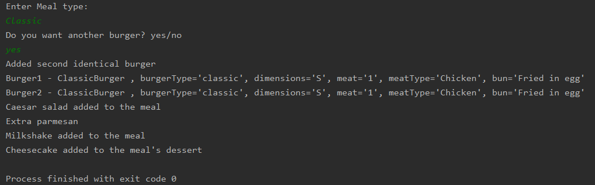
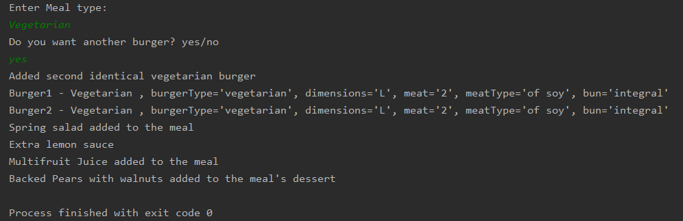

## Topic: Creational Design Patterns
### **Author: Postovan Teodora**
### Main tasks :
1. Choose an OO programming language and a suitable IDE or Editor (No frameworks/libs/engines allowed);
2. Select a domain area for the sample project;
3. Define the main involved classes and think about what instantiation mechanisms are needed;
4. Based on the previous point, implement atleast 3 creational design patterns in your project;
### Used Design Patterns:
* Factory Method
* Abstract Factory 
* Prototype
### Explanation
**Domain area** - Create a Meal. 
In this project will be a factory named MealFactory  which will be build from different food components: desserts, drinks, salads, hamburgers.    

The main idea is to build two different meals, vegetarian and classic one.

**Abstract factory  is seen in the packages** - Desserts, Drinks and Salads. I implemented an interface
with one or two void methods, for their components, then depending of vegetarian or classic meal 
I created concrete food classes, and implement the same method as the interface(**where it can be 
observed the factory method**)

**MealFactory** - an abstract factory interface with a set of creation methods for all the 
abstract food type. 

**VegetarianMealFactory and ClassicMealFactory** - concrete factory classes for each type of meal variant. 

**Meal** - the factory initialization which instantiates one of the concrete factory classes.

**Buyer** - the main one class where the "buyer" is requesting the meal (vegetarian or classic) 
and the corresponding meal is "served" using the factory classes  and  required components.

**Prototype** - I have an abstract class for the hamburger component  
with the clone() method which will be implemented by child classes. This prototype class defines  
an alternative constructor that accepts an object of the class as an argument. The clone() method  
consist only of the "new" line which uses its own class name. 
The advantages of using the clone method are: 
* If we use assignment operator to assign an object reference to another reference variable then it 
will point to same address location of the old object and no new copy of the object will be created. 
Due to this any changes in reference variable will be reflected in original object.
* If we use copy constructor, then we have to copy all of the data over explicitly i.e. we have to 
reassign all the fields of the class in constructor explicitly. But in clone method this work of creating 
a new copy is done by the method itself.So to avoid extra processing we use object cloning.

Run from the Buyer class, you will be asked to input the desired meal and then if you want  
one more burger(yes/no) and then the output of your ordered meal.

### Code Examples
Abstract class that show the prototype
```java
public abstract class Hamburger {
    public String dimensions;
    public String meatType;
    public String bun;
    public int meat;

    public Hamburger() { }

    public Hamburger(Hamburger component) {
        if (component != null) {
            this.dimensions = component.dimensions;
            this.meatType = component.meatType;
            this.bun = component.bun;
            this.meat = component.meat;
        }
    }
```
Child class ClassicBurger that override the clone() method
```java
public class ClassicBurger extends Hamburger {
    public String burgerType;

    public ClassicBurger() {
    }

    public ClassicBurger(ClassicBurger target) {
        super(target);
        if (target != null) {
            this.burgerType = target.burgerType;
        }
    }

    @Override
    public Hamburger clone() {
        return new ClassicBurger(this);
    }
```
### Output
* Classic Meal

* Vegetarian Meal

